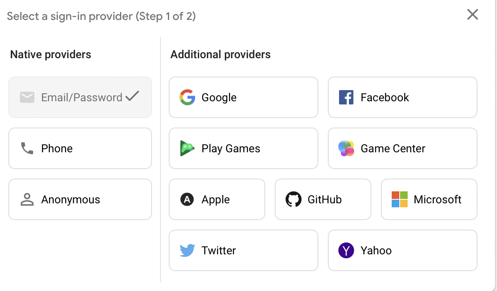
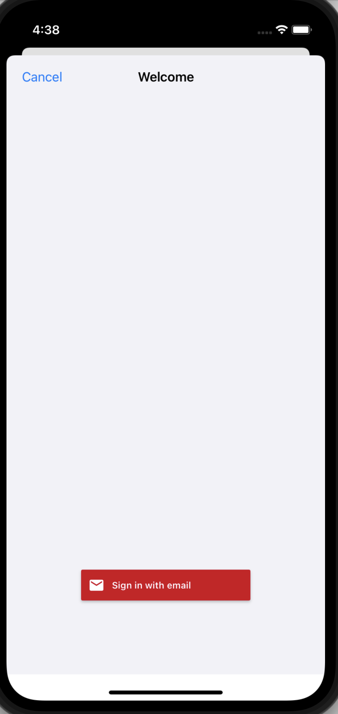
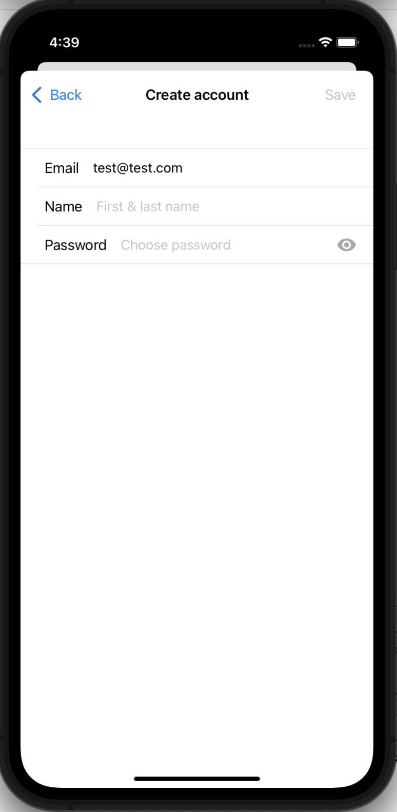

#  Firebase Auth Demo
This app shows you how to handle authentication with Firebase. It is based on the amazing
iOS Databases course by codewithchris.com. 

## Setting up Authentication
After installing the FirebaseAuth and FirebaseFirstore packages, we can choose, which 
modules to use within the Firebase console for authentication. There are many authentication
providers we can accept, but will choose the email only for now:


We can use Google's pre-built UIs in order to get started even faster: 
https://firebase.google.com/docs/auth/ios/firebaseui?authuser=0.

### Locking Down the Database
See here for a good article on how to use different rules to control access to different Firestore collections:
https://khreniak.medium.com/cloud-firestore-security-rules-basics-fac6b6bea18e

## Pre-Built UI Views
Thanks to Google, you can implement a great login view within a few minutes. It will automatically interact with
Firebase's Authentication screen to login the user. 




Code to display Google's pre-built UI:
```
//
//  LoginForm.swift
//  Firebase Auth Demo (iOS)
//
//  Created by Andrew Gholson on 12/29/21.
//

import Foundation
import SwiftUI
import FirebaseEmailAuthUI


/*
 Used to display pre-made Google login forms for authentication.
 */
struct LoginForm: UIViewControllerRepresentable {
    
    func makeUIViewController(context: Context) -> UINavigationController {
        let authUI = FUIAuth.defaultAuthUI()
        
        // Ensure authUI is not nil
        guard authUI != nil else {
            return UINavigationController()
        }
        
        // Setup the list of login providers we accept e.g. Facebook, Google, etc.
        let providers = [FUIEmailAuth()]
        
        authUI!.providers = providers
        
        return authUI!.authViewController()
        
    }
    
    func updateUIViewController(_ uiViewController: UINavigationController, context: Context) {
        
    }
    
}

```
